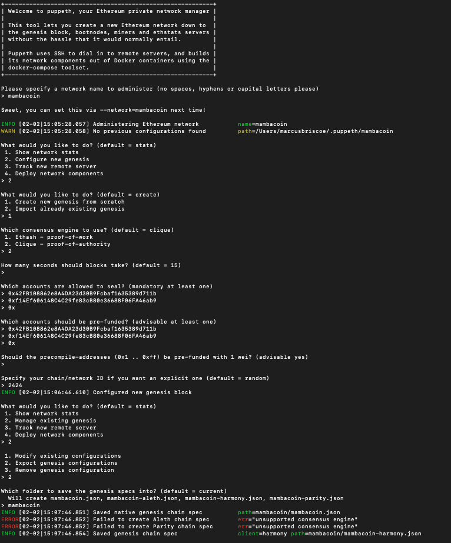
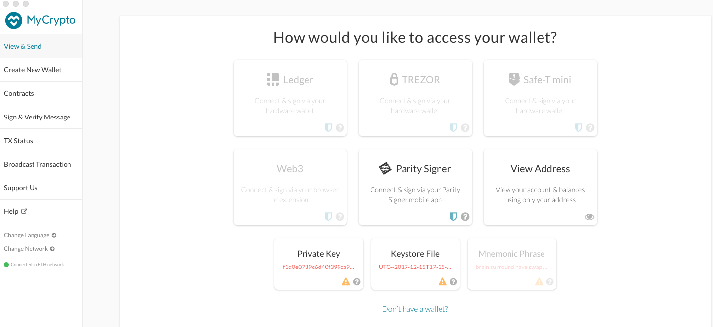
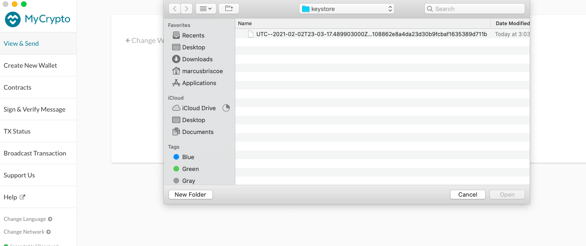
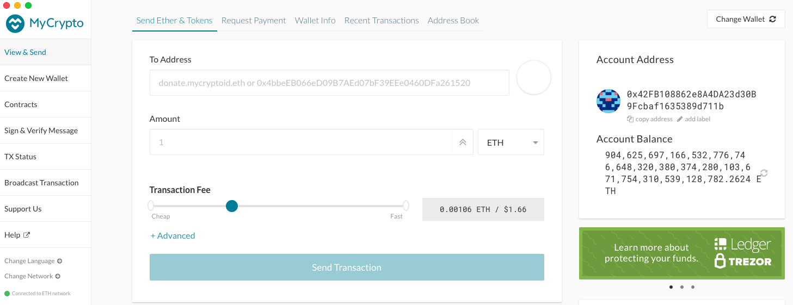
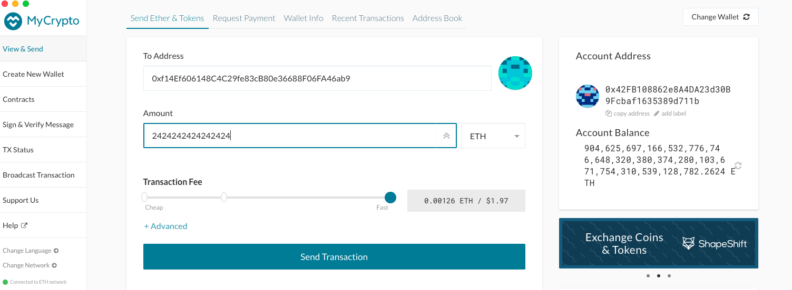
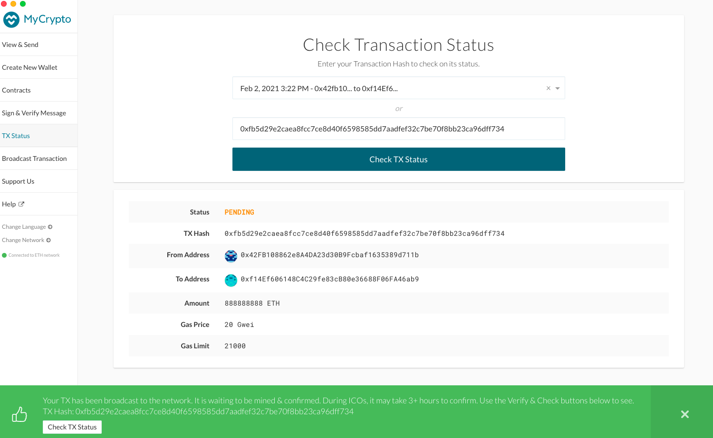

# Launching the ZBank Block Chain Testnet

In order for ZBank to keep up with the modern FinTech world, we will need to start using block chain.
To get everyone up to speed, we will set up a testnet so we can experiment in order to become familiar with it.
That is what we will be doing here.

##Getting Started

We will have to set up our computers to be able to operate a digital wallet through which we will be able to send and receive virtual coin.
To start, we will download MyCrypto from the company website to use our wallets.

<https://download.mycrypto.com/>

We will also need to download Go Ethereum so that we can use our Command Line to run everything:

<https://geth.ethereum.org/downloads/>

Note: Be sure to download the latest version of "Geth & Tools" from the site. The tools are important.

Once we've gone through the download process, we are ready to set up our block chain.

##Setting it up
For example, we are going to create a block chain called Mambacoin. Here's how to do it:
In order to run this on the command line, navigate to the folder with all of your Geth tools.

First, we have to set up our nodes by entering the following:

	./geth --datadir node8 account new

You will be asked to create a password. Make sure you write down these passwords and node names in a separate file so you don't forget them.
When the new key is generated, it will give you it's public address and the path of the key. Save both of these with your node info.

Once that's set up, do the same thing for your second node, which will be known as node24 here:

	./geth --datadir node24 account new

rinse. repeat.

##Create the Genesis Block

* run puppeth by entering: ./puppeth

You will be given prompts. In order, you'll want to select the following:

* Configure new genesis
* Create new genesis from scratch
* Clique - proof-of-authority <--note: this is the most secure consensus algorithm
* How many seconds should the blocks take? 15 seconds
* Which accounts are allowed to seal?: (Copy/paste the addresses of both of your nodes here.)
* Which accounts should be pre-funded?: (Copy/paste those node addresses again)
* Should the addresses be pre-funded with wei? no
* Specify your chain ID: Whatever number you want (save this with your node info)

The block has been created, and you'll want to create a json file with the configuration by selecting "Export" and stashing it in the mambacoin folder that you created.

##Initialize the Nodes
Initialize node8 with the following code:

	./geth --datadir node8 init mambacoin/mambacoin.json
	
Once it's initialized, repeat with node24:

    ./geth --datadir node24 init mambacoin/mambacoin.json

##Unlock the Nodes
Unlock the first node by entering:

    ./geth --datadir node8 --unlock "NODE_8'S_KEY" --mine --rpc --allow-insecure-unlock

###Flags:

--datadir

--unlock: unlocks the node

--mine: tells it to mine

--rpc: opens port for another node to connect

--allow-insecure-unlock: overrides the built-in security measure

You will be asked for the password, but you might not see the prompt. Type that in anyway. Once it has been unlocked, you'll need to find the enode and copy that to your node info.
Hint: It will be in the right-hand column.

,pic,

Unlock node 24 by opening another CLI terminal and run the following:

	./geth --datadir node24 --unlock "NODE_24'S_ADDRESS" --mine --port 30304 --bootnodes "NODE 8'S ENODE" --ipcdisable --allow-insecure-unlock

###More Flags:
--port 30304: port 30303 is being used by node 8 (per the enode info), and you can only use one port per node, so this is the next one. 

--bootnodes:

--ipcdisable: 

You'll be asked for node 24's password. Again, you might not see the prompt, but enter it anyway. It's there.

Congratulations! Both nodes should be mining and communicating continuously at this point.

##Let's Make a Transaction!
Go to your MyCrypto application

###Set Up Your Custom Node

* On the left side of the window, select "Change Network" and scroll down to "Custom".

* In the "Node Name" and "Network Name" fields, fill in "mambacoin".
* Set "Network" to "Custom"
* Set "Currency" to "ETH"
* Set "Chain ID" to the Chain ID you came up with earlier.
* Set URL to "http://127.0.0.1:8545
* Select "Save & Use Custom Node"

###Access Your Wallet
* Click "View & Send". 

* Click on the "Keystore File" Block.

* Click "Select Wallet File" and use the keystore file for node8, and enter it's password in the appropriate field. 
* You should see your account info., and a boatload of fake money!
Now let's send some to ourselves!

###Send Funds

* In the "To Address" field, enter the address for node24.
Select any amount you want to send. 

* Click on "Send Transaction"

* To check on the transaction, click on the "Check TX Status" popup button and log out when prompted to.

The transaction may take a while, and will be "Pending" until it's successful.

Voila! You've made a transaction on the mambacoin blockchain!
